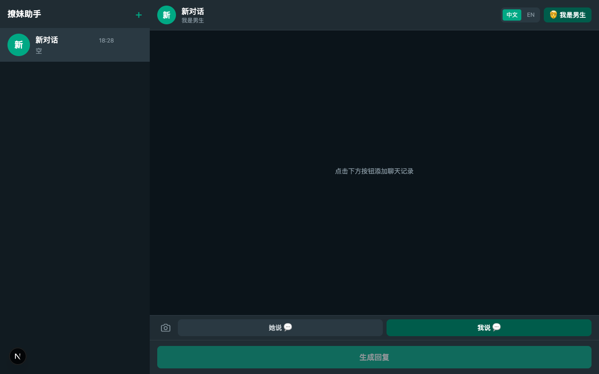

# Wingman

> Your crush texts "k". You panic. Wingman analyzes the vibe, reads between the lines, and generates replies that actually work. Supports male & female perspectives, Chinese & English, and runs 100% offline. No cloud, no data leaks, no cringe. Just better conversations.

[中文文档](README_CN.md)

## What is Wingman?

Wingman is a WhatsApp-style AI chat assistant that helps you craft better replies. It analyzes your conversation context, detects emotional tone and relationship dynamics, then generates natural, context-aware response options — all running locally on your machine.

**Key principles:**
- 🔒 **Privacy-first** — Everything runs locally via Ollama. Your conversations never leave your device.
- 🎯 **Context-aware** — AI understands tone, interest level, emotional state, and relationship stage.
- 💬 **Multi-session** — Chat with multiple people simultaneously, each with its own analysis.
- 🌍 **Bilingual** — Full Chinese and English support with per-session language settings.

## Demo



> 📸 **Want to see it in action?** The screenshot above shows Wingman analyzing a conversation and generating contextual replies.

## Features

| Feature | Description |
|---------|-------------|
| **AI Analysis** | Automatically detects tone, interest level, emotional state, relationship stage, and subtext |
| **Smart Replies** | Generates 2-3 context-aware replies per unreplied message |
| **Reply-to-Message** | Quote specific messages via right-click, hover icon, or swipe |
| **Multi-session** | Manage multiple conversations with separate analysis |
| **Gender Toggle** | Switch between male/female perspective, AI adjusts accordingly |
| **User Style Detection** | Analyzes your typing patterns, AI mimics your voice |
| **Chinese & English** | Full bilingual support with per-session language settings |
| **Social Profile** | Fetch Instagram profile info to personalize AI responses — analyzes bio for communication style, interests, and personality |

## 🆕 New Features

### Social Profile Context

Fetch public Instagram profile data to give the AI context about who you're chatting with:

| Feature | Description |
|---------|-------------|
| **One-click Fetch** | Paste an Instagram URL → automatically extracts display name and bio |
| **Auto Analysis** | Saves profile → AI analyzes bio for communication style, interests, and personality traits |
| **Per-session** | Each session has its own profile, isolated from others |
| **Ego lite** | Uses your real logged-in browser session for reliable Instagram access |
| **Editable** | Name and bio can be manually edited before saving |

Profile data is injected into AI prompts, helping Wingman tailor replies to the person's vibe and communication style.

### Screenshot Upload & Recognition

Upload WhatsApp chat screenshots to automatically extract and recognize message content:

| Feature | Description |
|---------|-------------|
| **One-click Upload** | Click the camera icon next to the input box to upload screenshots |
| **OCR Recognition** | Uses PaddleOCR to accurately extract Chinese and English text |
| **Smart Segmentation** | Automatically segments long screenshots to ensure complete extraction |
| **Margin Padding** | Adds margin processing to recognize edge text |
| **Sender Detection** | Automatically determines sender based on message position (left/right) |
| **Reply Linking** | Automatically detects reply patterns ("You replied to…" / "[Name] replied to you") — matches quoted text to original messages and adds reply quote bars |
| **Previous Chat Matching** | Matches quoted text against your existing chat history for accurate reply linking |
| **Batch Confirmation** | Preview all recognized results in a popup, selectively add messages |
| **Bilingual Support** | Supports both Chinese and English chat screenshots |

**How to use:**
1. Click the 📷 camera icon next to the input box
2. Select a WhatsApp chat screenshot
3. Wait for OCR recognition (~30 seconds)
4. Preview recognized results, select messages to add
5. Click "Add Selected" or "Add All"

## Quick Start

```bash
git clone https://github.com/ZienACCA/Wingman.git
cd Wingman
./setup.sh
```

One command does everything: installs Ollama, installs PaddleOCR, downloads the model, starts the app, and opens the browser.

### What the setup script does:

1. ✅ Checks for Python3, pip3, and Ollama (installs Ollama if missing)
2. ✅ Starts the Ollama server
3. ✅ Downloads Qwen 2.5 7B model (~4.7GB)
4. ✅ Installs PaddleOCR Python dependencies (for screenshot recognition)
5. ✅ Installs npm dependencies
6. ✅ Opens http://localhost:3000

## Manual Install

```bash
git clone https://github.com/ZienACCA/Wingman.git
cd Wingman
npm install
npm run dev
```

### Prerequisites

- [Node.js](https://nodejs.org/) 18+
- [Ollama](https://ollama.ai) installed and running
- [Python3](https://python.org) + PaddleOCR (for screenshot recognition)
- [ego lite](https://ego.app) — browser automation for Instagram profile fetching (optional but recommended)

```bash
pip install paddlepaddle paddleocr
```

## How It Works

### 1. Add Messages

Paste or type your chat conversation. Add messages from both sides:
- **Her messages** — What the other person said
- **My messages** — What you said (or want to say)

### 2. Analyze

Click "Analyze & Generate Replies". Wingman will:
- Parse the conversation flow
- Detect emotional tone and interest level
- Identify relationship stage
- Generate context-aware reply options

### 3. Reply

Choose from AI-generated options or type your own. Each unreplied message gets its own set of suggestions.

### Screenshot Upload

1. Click the 📷 camera icon next to the input box, **or** drag & drop an image directly onto the chat area
2. Select a WhatsApp chat screenshot
3. Wait for OCR recognition (~30 seconds)
4. Preview recognized results, select messages to add
5. Click "Add Selected" or "Add All"

### Reply-to-Message

Quote specific messages in your reply:
- **Hover** — Click the reply icon that appears on hover
- **Right-click** — Select "Reply" from the context menu
- **Swipe** — Drag right on touch devices

## Architecture

```
wingman/
├── app/
│   ├── api/
│   │   ├── chat/route.ts          # AI analysis + reply generation
│   │   ├── ocr/route.ts           # Screenshot OCR recognition
│   │   ├── profile/
│   │   │   ├── analyze/route.ts   # Profile analysis (Qwen-based)
│   │   │   └── fetch/route.ts     # Instagram profile fetching
│   │   └── regenerate/route.ts    # Regenerate replies
│   └── page.tsx                   # Main page
├── components/
│   ├── ChatInput.tsx              # Chat UI with reply support
│   ├── LanguageSwitch.tsx         # Language toggle
│   ├── ScreenshotReviewModal.tsx  # Screenshot preview modal
│   ├── SessionList.tsx            # Session sidebar
│   └── SocialProfilePanel.tsx     # Profile fetch + analysis UI
├── lib/
│   ├── agent.ts                   # AI prompt engineering + parsing
│   ├── ego-browser.ts             # ego lite CLI integration
│   ├── i18n.ts                    # Internationalization
│   ├── storage.ts                 # LocalStorage persistence
│   └── userStyle.ts               # User typing style detection
├── scripts/
│   └── ocr.py                     # PaddleOCR text extraction
├── setup.sh                       # One-click setup script
└── types/
    └── index.ts                   # TypeScript definitions
```

## Tech Stack

| Technology | Purpose |
|------------|---------|
| [Next.js 16](https://nextjs.org/) | React framework + API routes |
| [Tailwind CSS v4](https://tailwindcss.com/) | WhatsApp-style dark theme |
| [Ollama](https://ollama.ai) | Local LLM runtime |
| [Qwen 2.5 7B](https://ollama.ai/library/qwen2.5) | Language model for analysis + replies |
| [PaddleOCR](https://github.com/PaddlePaddle/PaddleOCR) | Screenshot text recognition |
| [ego lite](https://ego.app) | Browser automation for Instagram profile fetch |
| TypeScript | Type safety |

## AI Prompts

Wingman uses carefully engineered prompts that:
- Split chat into "context" vs "needs reply" sections
- Use numbered message IDs for precise reply mapping
- Include user's detected typing style
- Enforce role clarity (who is replying to whom)
- Prevent common AI mistakes (role reversal, mixing up messages)

See `lib/agent.ts` for the full prompt engineering.

## License

MIT License - see [LICENSE](LICENSE) for details.

---

<p align="center">
  Made with ❤️ for better conversations
</p>
